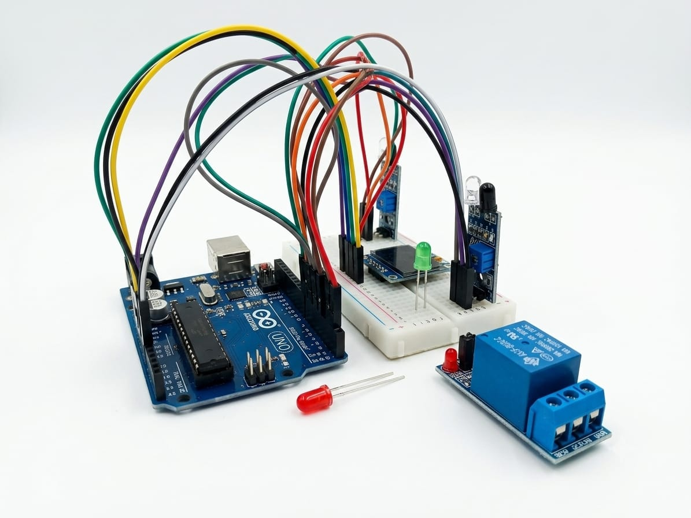
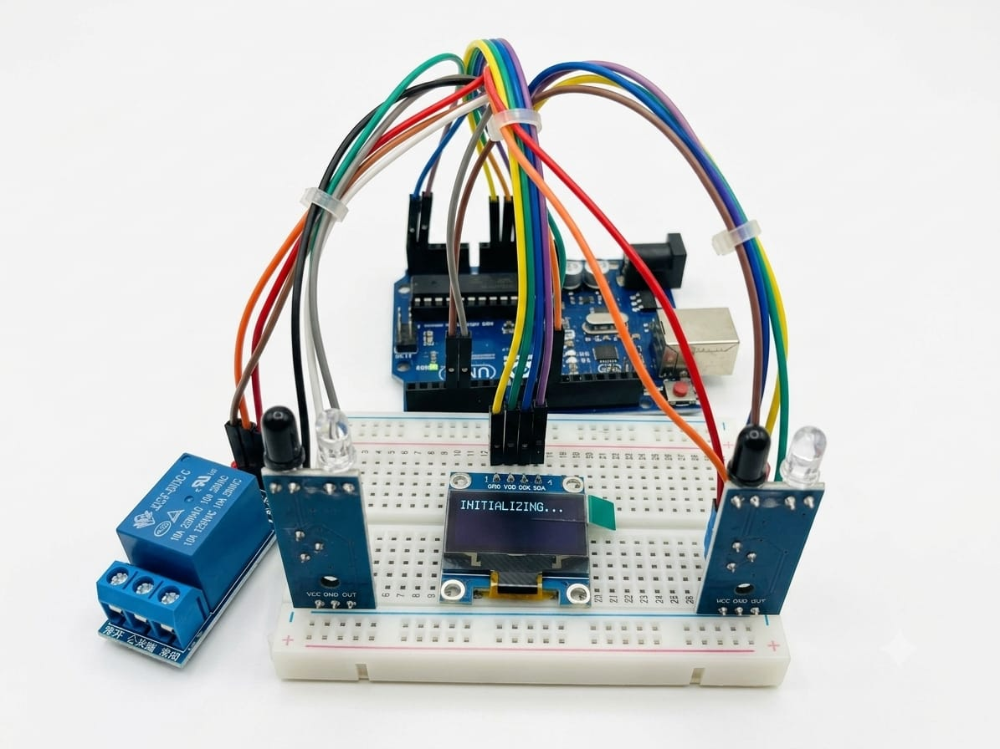

# Smart Room Occupancy Counter

An Arduino-based occupancy monitoring system that detects people entering and leaving a room using two IR sensors, displays the live occupancy count on an OLED display, and automatically controls room lighting using a relay module.

This project demonstrates embedded system design, sensor interfacing, finite state machine (FSM) logic, non-blocking programming using `millis()`, and basic energy-saving automation.

---

## Project Overview

The Smart Room Occupancy Counter automatically counts the number of people inside a room. Two infrared sensors placed at the entrance detect the direction of movement. Based on the sequence in which the sensors are triggered, the system determines whether a person has entered or exited.

The occupancy count is displayed on a 0.96-inch SSD1306 OLED display. Whenever at least one person is present inside the room, the relay module turns ON the room light. When the room becomes empty, the relay automatically turns OFF the light, reducing unnecessary power consumption.

---

## Features

- Dual IR sensor based entry and exit detection
- Finite State Machine (FSM) based occupancy tracking
- Software debounce for reliable sensor readings
- Automatic light control using relay module
- Real-time OLED display of occupancy count
- Non-blocking programming using `millis()`
- Modular and maintainable Arduino code

---

## Hardware Used

| Component | Quantity |
|-----------|---------:|
| Arduino UNO | 1 |
| IR Sensor Module | 2 |
| SSD1306 OLED Display (I2C) | 1 |
| Relay Module | 1 |
| COB LED | 1 |
| 220 Ω Resistor | 1 |
| 10 kΩ Resistor | 1 |
| Breadboard & Jumper Wires | As required |

---

## Software Used

- Arduino IDE
- Visual Studio Code
- Embedded C/C++

### Libraries

- Wire
- Adafruit GFX
- Adafruit SSD1306

---

## Folder Structure

```text
Smart-Room-Occupancy-Counter
│
├── Code
│   └── Smart_Occupancy_Counter.ino
│
├── Circuit_Diagram
│
├── Documentation
│   ├── Project_Specification.md
│   ├── Working_Principle.md
│   ├── Project_Report.md
│   ├── Installation_Guide.md
│   └── Troubleshooting.md
│
├── Hardware
│   ├── Components_List.md
│   └── Bill_of_Materials.md
│
├── Images
│
├── LICENSE
└── README.md
```

---

## Working Principle

The system uses two IR sensors positioned at the entrance of a room.

- If Sensor A is triggered before Sensor B, the system recognizes an **entry** and increases the occupancy count.
- If Sensor B is triggered before Sensor A, the system recognizes an **exit** and decreases the occupancy count.
- The updated occupancy count is displayed on the OLED display.
- If the occupancy count is greater than zero, the relay turns ON the room light.
- If the occupancy count becomes zero, the relay turns OFF the room light automatically.

---

## Pin Connections

| Arduino Pin | Connected Device |
|-------------|------------------|
| D2 | IR Sensor A |
| D3 | IR Sensor B |
| D8 | Relay Module |
| A4 | OLED SDA |
| A5 | OLED SCL |
| 5V | VCC |
| GND | GND |

---

## Project Images

### Prototype Overview



Complete hardware setup of the Smart Room Occupancy Counter using an Arduino UNO, dual IR sensors, OLED display, relay module, and breadboard connections.

---

### Hardware Setup



Front view of the implemented prototype highlighting the sensor placement, OLED display, relay module, and wiring arrangement used for testing.

---

### OLED Output


OLED display showing the system interface with the current occupancy count and light status during project operation.
---

## Future Improvements

- ESP32-based wireless monitoring
- IoT dashboard using MQTT
- Mobile application integration
- Cloud data logging
- Real-Time Clock (RTC) support
- PCB implementation
- AI-based people detection using camera vision

---

## Author

**Janaki Raman K**

Maintenance Engineer | Electrical & Electronics Engineer

GitHub: https://github.com/Rocky3679

LinkedIn: https://linkedin.com/in/janaki-ramank

---

## License

This project is licensed under the MIT License. See the LICENSE file for details.